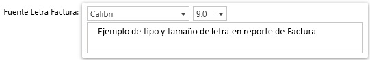

# Historial de Versiones

Historial de versiones de SamitApps

## Version 1.0.0.81 
Fecha: 21 de Mayo 2021

### ✨ Nuevas Funcionalidades

* Se agrego un parámetro de personalización para que se pueda establecer el tamaño y la fuente del texto de las facturas.
    > [!NOTE]
    > - El Tipo y Tamaño de fuente predeterminadas es **Arial** al tamaño **7.0**
    > - Si se cambia el tipo de fuente se debe probar con distintos
    tamaños hasta encontrar el que mejor ajuste al tipo de letra
    > - El nuevo parametro se encuentra en el menu **"Definición de Comprobantes"** en la pestaña **Parametros de Facturacion**.\
    >   

    > [!ATTENTION]
    > - No se recomienda subir el tamaño por encima de 8.5
    > - Los tamaños 7.5 y 8.0 son los más indicados para la factura

- Se agrega menu **"Listar Documentos"** en el modulo de **Contabilidad**.

### ✔️ Errores Arreglados

- En el menu **"Ingreso de Comprobantes"** se ajusto el comportamiento del campo de la cuenta contable para que se ajuste el formulario recien se selecciona la cuenta.

### 🔨 Mejoras Aplicadas

- En el menu **"Movimientos por Comprobantes"** se habilito la opción para imprimir todos los comprobantes de la lista ademas de solo el que se encuentra seleccionado.
- Se optimizo el proceso de envio de facturas electronicas, ahora se envia en dos pasos.
- Se cambio la notificacion que se muestra al enviar la factura electronica.

## Version 1.0.0.80
Fecha: 10 de Mayo 2021

### ✨ Nuevas Funcionalidades

- Se agrego un parámetro de personalización para que se muestre el total de items y productos en las facturas de venta.
    > [!NOTE]
    > - El nuevo parametro se encuentra en el menu **"Definición de Comprobantes"** en la pestaña **Parametros de Facturacion**.

### ✔️ Errores Arreglados

- Arreglos menores